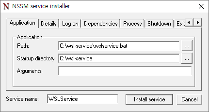
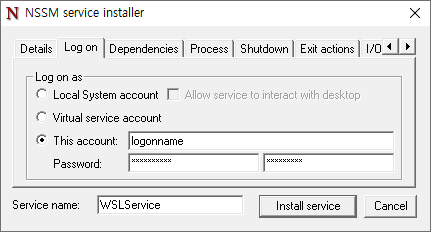
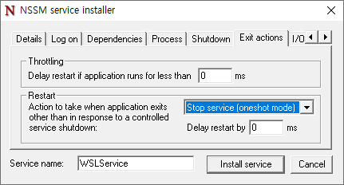
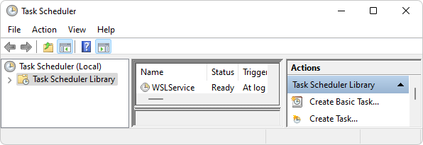
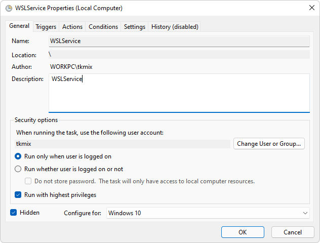
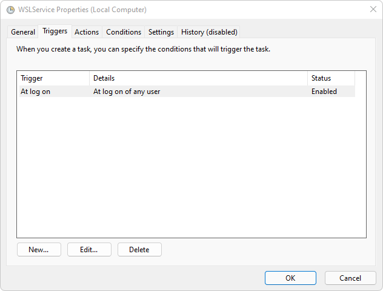
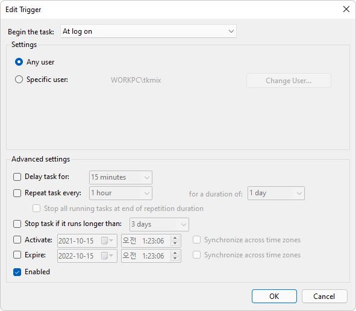
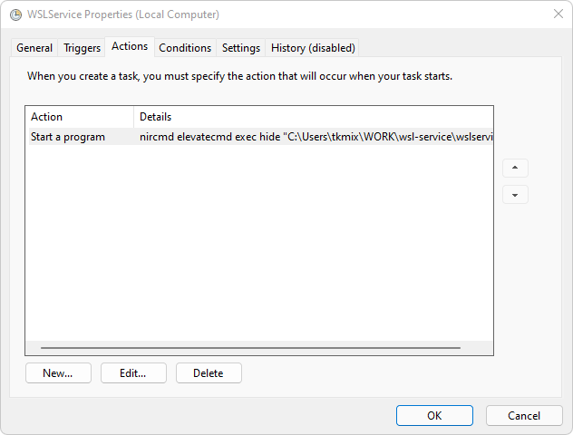
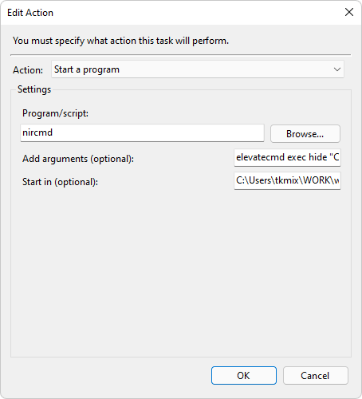

# WSL Service

* Helps WSL(Windows Subsystem for Linux) startup on your Windows boot.
* Automatically configure your Windows and WSL's static ip address, firewall, proxy ports.
* WSL Service will startup and executes init commands your WSL without Windows logon.
* You can run web server like as linux daemon with init commands.
* You can configure your own settings with json file.

## Requirements

* Python 3 is required in your Windows.
* Tested with Windows 10~11, Python 3.8~3.9, WSL2 Ubuntu-20.04

## How to use

* Download or clone this repository.
* Execute `wslservice.bat`, to test if it works on your environment.
* Follow next described step for automatic startup on Windows boot.
* Register as **Windows Service** or **Task Scheduler**

## How to register as Windows Service

#### To Install as Windows Service (<u>Only for Windows 10</u>)

* <u>Only works in Windows 10, has problem in Windows 11</u>, does not allow mounted WLS directory permission while accessing thru Windows 11 File Explorer.

1. Install NSSM(Non-Sucking Service Manager). Download form [nssm.cc](https://nssm.cc/) and install or install with following command. Windows administrator privileges are required.

    ```bash
    choco install nssm
    ```

2. Register `wslservice.bat` as windows service. windows administrator privileges are required.

    ```bash
    nssm.exe install WSLService
    ```
    
    
    

3. Open Windows Service panel with following command and start `WSLService`.

    ```
    services.msc
    ```

#### To Remove from Windows Service

1. Open Windows Service panel with following command and stop `WSLService`.

    ```
    services.msc
    ```

2. Remove with following command.

    ```bash
    nssm.exe remove WSLService
    ```

## How to register as Task Scheduler

#### To Install as Task Scheduler (<u>Recommended for windows 11</u>)

* Resolves WLS directory permission problem while accessing thru Windows 11 File Explorer.

2. Install [NirCmd](https://www.nirsoft.net/utils/nircmd.html). Download form [nirsoft.net](https://www.nirsoft.net/utils/nircmd.html) and install or install with following command. Windows administrator privileges are required.

    ```bash
    choco install nircmd
    ```

3. Create new task with `wslservice.bat` script at Task Scheduler.

    ```bash
    taskschd.msc
    ```
    
    
    
    `Create New Task`
    
    General Tab
    
    
    
    Triggers Tab
    
    
    
    
    Actions Tab
    
    
    
    
    Program/script: `nircmd`
    Add arguments: `elevatecmd exec hide "path/to/wsl-service/wslservice.bat"`
    Start in: `path/to/wsl-service`
    
4. If you want to execute manually for a specific purpose, or to create shortcut icon, use `wslservicetask.bat` file which run task registered at scheduler.

## Your own configuration

Default settings fie is `wsl-service/source/settings.json`. Copy to `wsl-service/settings.json` then config your own settings.

* `BINDING_ADDRESS`: Static local ip address for your WSL.
* `FIREWALL_ALLOWED_PORTS`: Automatic registeration on Windows firewall allowed port.
* `PROXY_FORWARDING_TCP_PORTS`: Automatic registeration on Windows proxy port forwarding.
* `INITD_SERVICES`: Automatically executes startup services such as ssh, nginx, mysql, redis, ...
* `INITD_EXECUTES`: Automatically executes additional commands on startup such as your own server.

## TODO

* Automatic Windows service registration.
